# 🛡️ Web Application Security Assessment Report

---

## 📌 1. Overview

This project focuses on identifying, exploiting, and securing common vulnerabilities in a Flask-based web application.

The work was completed over **4 weeks**, progressing from vulnerability discovery to implementing strong defensive mechanisms and validating them through testing.

---

## 🔍 2. Week 1–2: Vulnerability Identification

### 🔴 SQL Injection

The login system was vulnerable to SQL Injection.

**Payload used:**

```sql
admin' OR '1'='1
```

**Impact:**

* Authentication bypass
* Unauthorized access

📸 **Evidence:**

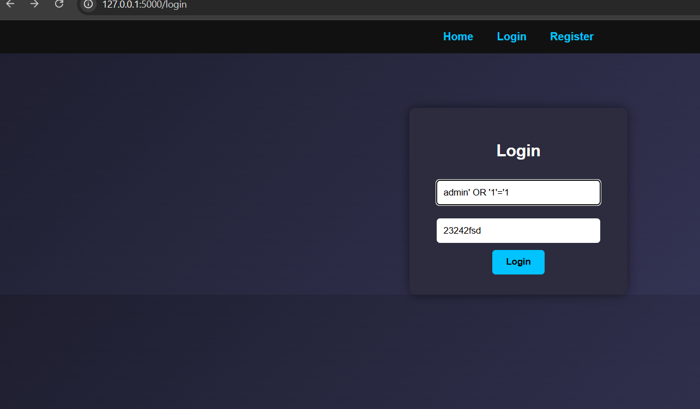
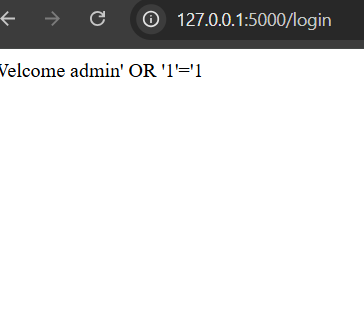
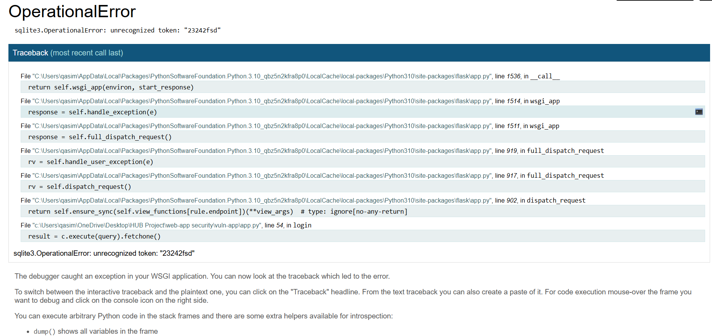

---

### 🔴 Cross-Site Scripting (XSS)

User input was not sanitized, allowing script execution.

**Payload used:**

```html
<script>alert('XSS')</script>
```

**Impact:**

* Execution of malicious scripts
* Session hijacking risk

---

### 🔴 Weak Password Storage

Passwords were stored in plain text.

**Impact:**

* Easy credential theft
* Full account compromise

---

### 🔴 Error-Based SQL Injection

Application exposed raw database errors.

**Impact:**

* Information leakage
* Helps attackers map database structure

---

## 🧪 3. Week 3: Testing & Exploitation

Vulnerabilities were tested using:

* Manual browser testing
* SQL Injection payloads
* XSS execution
* SQLite database inspection
* OWASP ZAP (optional)

📸 **Evidence:**

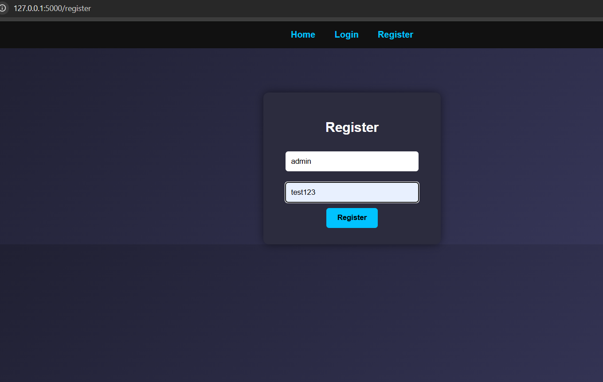
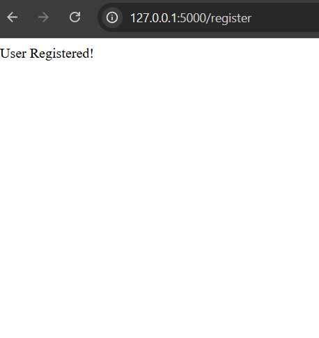
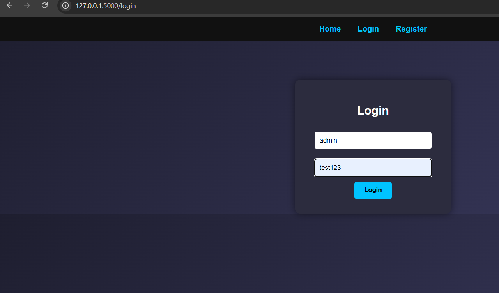
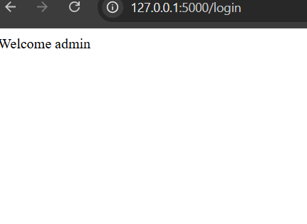

---

## 🛠️ 4. Week 3: Fixes Implemented

### 🔐 SQL Injection Prevention

* Replaced raw SQL queries with **parameterized queries**

### 🔐 Password Security

* Implemented hashing using:

  * `generate_password_hash()`
  * `check_password_hash()`

### 🔐 XSS Protection

* Sanitized input using:

  * `escape()` from `markupsafe`

### 🔐 Input Validation

* Enforced minimum username/password length

### 🔐 Error Handling

* Removed database error exposure to users

---

## 🛡️ 5. Week 4: Security Hardening & Defensive Testing

### ⚡ Rate Limiting

* Implemented using **Flask-Limiter**
* Limit: **5 requests per minute**

**Result:**

```
Too Many Requests
```

📸 **Evidence:**

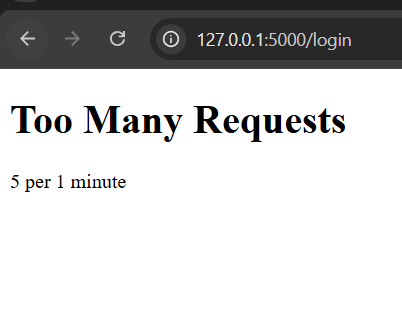

---

### 🚫 Intrusion Detection (Account Lock)

* Tracks failed login attempts
* Locks account after **5 failed attempts**

**Result:**

```
Account temporarily locked due to multiple failed attempts
```

📸 **Evidence:**

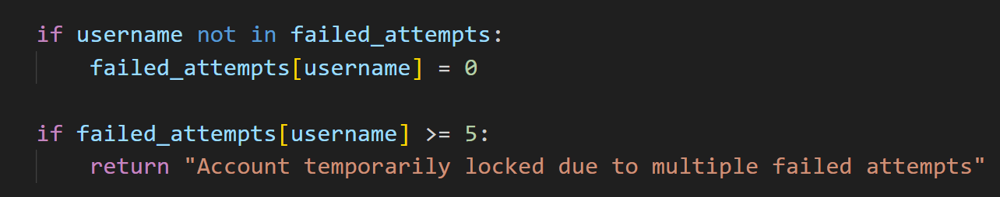

---

### 🔐 API Authorization Protection

* Implemented authentication checks for API endpoints

📸 **Evidence:**

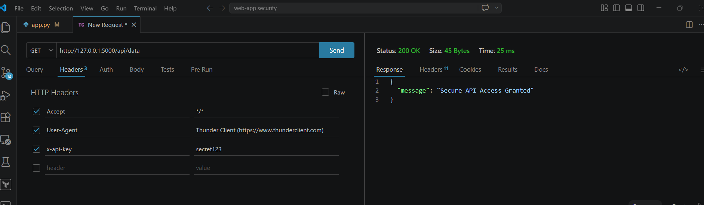
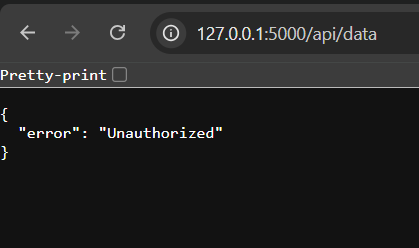

---

### 🛡️ SQL Injection & XSS Protections Verified

📸 **Evidence:**

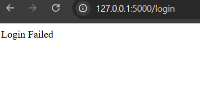
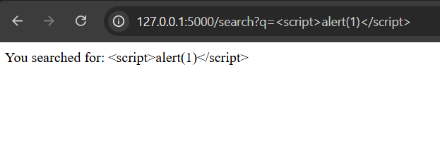

---

## ✅ 6. Final Outcome

After implementing all fixes and protections:

* SQL Injection → **Mitigated**
* XSS → **Prevented**
* Password storage → **Secured (hashed)**
* Brute force → **Blocked (rate limiting + lockout)**
* API access → **Restricted**

---

## 📚 Key Takeaways

* Never trust user input
* Always use parameterized queries
* Hash passwords — never store plain text
* Apply layered security (defense in depth)
* Test vulnerabilities before and after fixes

---

## 🚀 Future Improvements

* Add JWT-based authentication
* Implement CSRF protection
* Integrate automated security testing in CI/CD
* Deploy with HTTPS and secure headers

---
