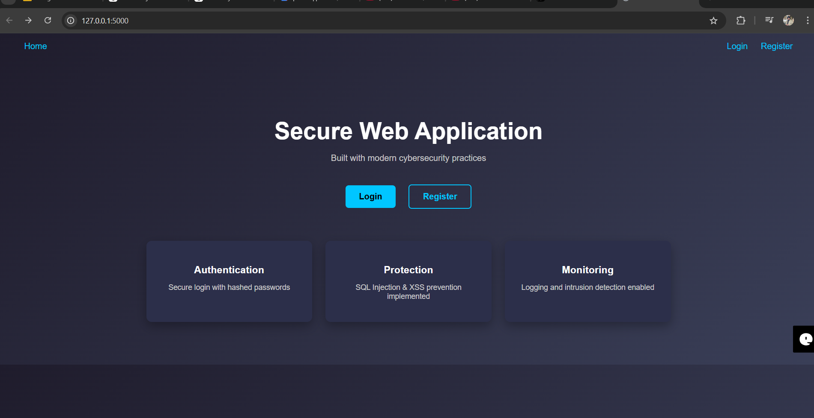
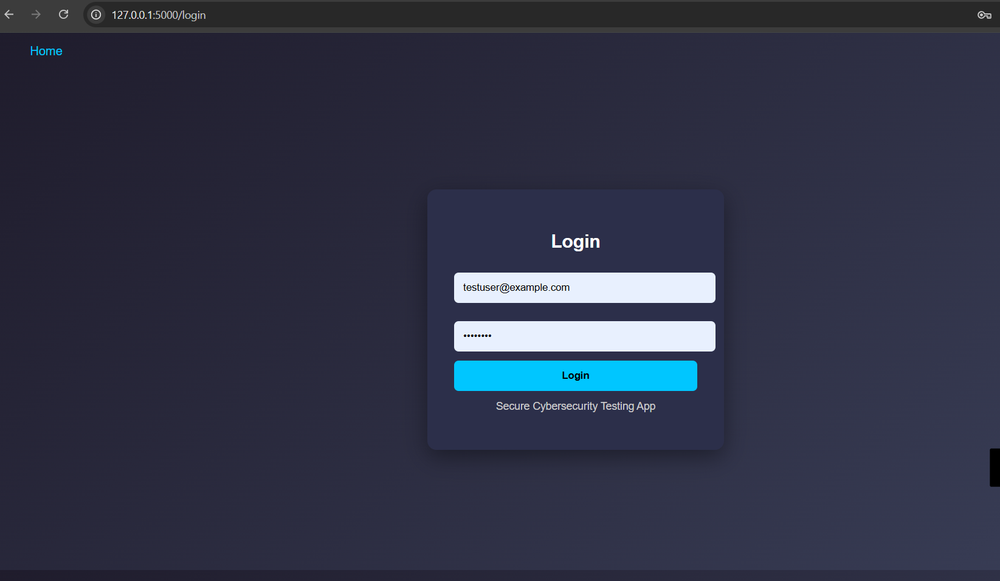
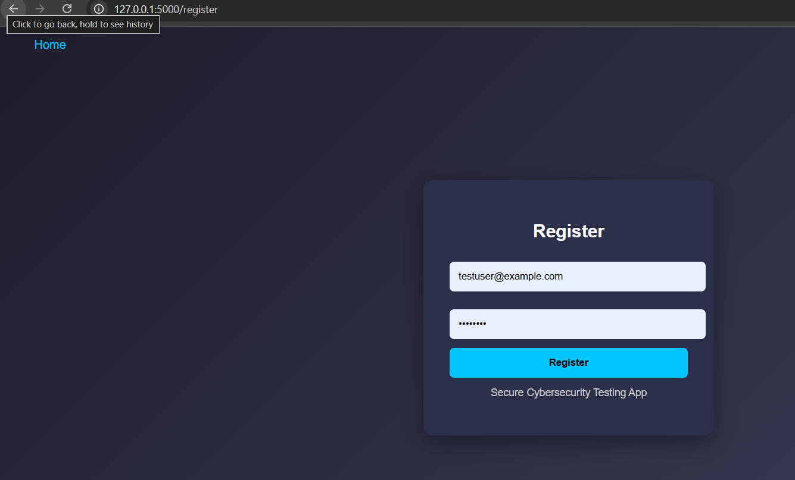
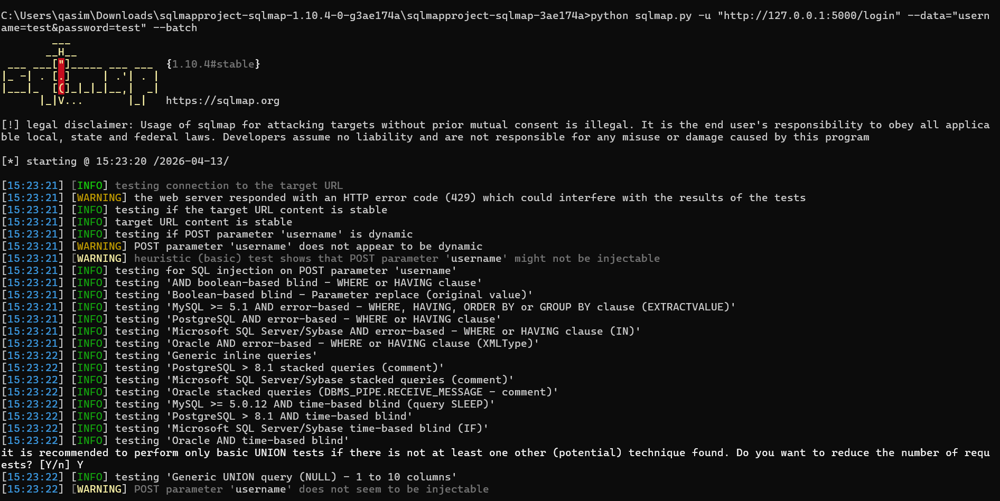
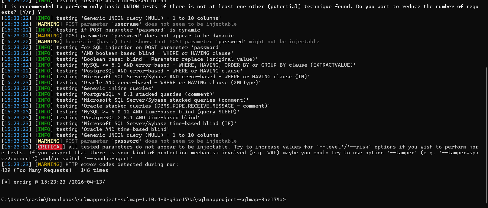
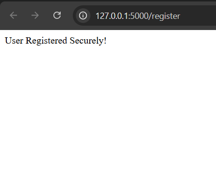
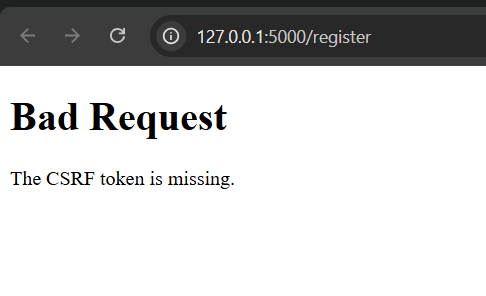

# 🛡️ Week 5: Ethical Hacking & Exploiting Vulnerabilities

## 📌 Objective

The goal of Week 5 was to perform ethical hacking on the developed Flask web application, identify vulnerabilities, exploit them in a controlled environment, and implement proper security fixes.

---

## 🔍 1. Reconnaissance (Basic Testing)

The application was analyzed to identify attack surfaces:

* Home Page
* Login Page
* Register Page
* API Endpoint (`/api/data`)

---

## 📸 Screenshots

### 🏠 Home Page



### 🔐 Login Page



### 📝 Register Page



---

## 💉 2. SQL Injection Testing (SQLMap)

### 🛠 Tool Used:

* SQLMap

### 💻 Command Used:

```bash
python sqlmap.py -u "http://127.0.0.1:5000/login" --data="username=test&password=test" --batch
```

### 📊 Result:

* No SQL Injection vulnerabilities found
* Application is protected using parameterized queries

---

## 📸 SQLMap Results

### Part 1



### Part 2



---

## ⚔️ 3. CSRF Attack (Before Protection)

A malicious HTML file (`csrf_attack.html`) was created to simulate a CSRF attack.

### 💥 Result:

* Attack was successful
* User was registered without user interaction

### 📸 Screenshot



---

## 🔐 4. CSRF Protection Implementation

### 🔧 Fix Applied:

* Implemented CSRF protection using Flask-WTF
* Added CSRF token to all forms
* Configured SECRET_KEY

### 💻 Example:

```python
from flask_wtf import CSRFProtect

csrf = CSRFProtect(app)
```

---

## 🛡️ 5. CSRF Attack After Protection

### ✅ Result:

* Attack was blocked
* Server returned error:

```
Bad Request: The CSRF token is missing.
```

### 📸 Screenshot



---

## 🧠 Key Learnings

* Practical use of SQLMap for automated testing
* Understanding SQL Injection prevention
* Real-world CSRF attack simulation
* Importance of CSRF tokens in web security
* Ethical hacking workflow (attack → fix → verify)

---

## ✅ Conclusion

In Week 5, ethical hacking techniques were successfully applied to test the application.

SQL Injection vulnerabilities were not found due to secure coding practices.
CSRF vulnerability was identified, exploited, and successfully mitigated using CSRF protection.

This demonstrates both offensive and defensive security skills.


