# 🔐 Week 6: Advanced Security Audits & Final Deployment

## 📌 Overview

In Week 6, advanced security testing and auditing were performed on the web application using multiple industry-standard tools.

---

## 🛠️ Tools Used

* OWASP ZAP
* Nikto
* Lynis

---

## 🔍 Security Audits Performed

### 🔹 OWASP ZAP

* Automated scan performed on the application
* Identified CSP issues and server header leaks

#### 📸 Screenshots

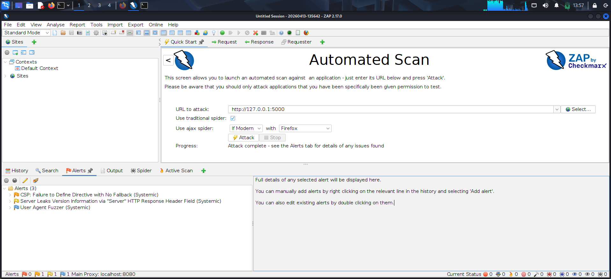
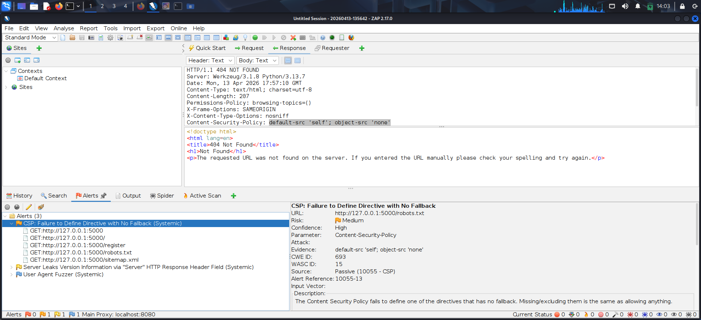
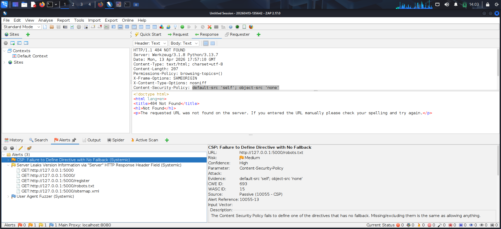
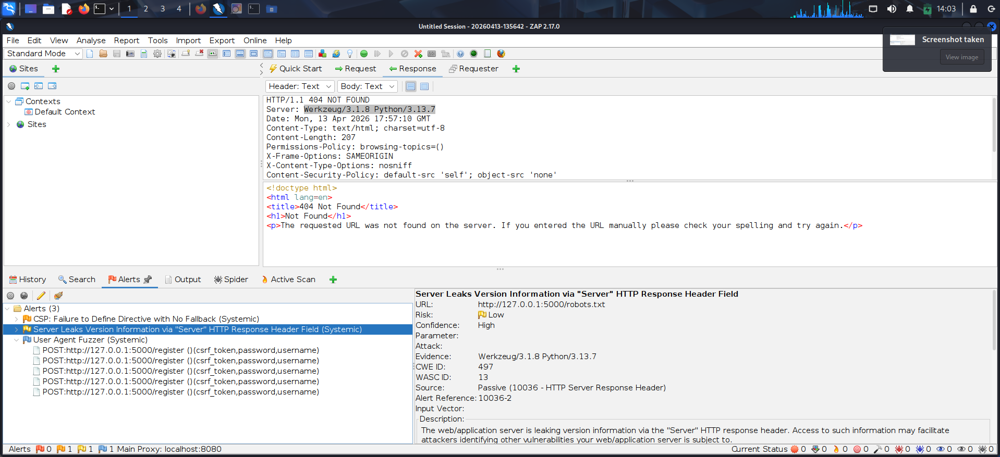

---

### 🔹 Nikto

* Scanned web server for vulnerabilities
* Found missing headers and exposed server info

#### 📸 Screenshots

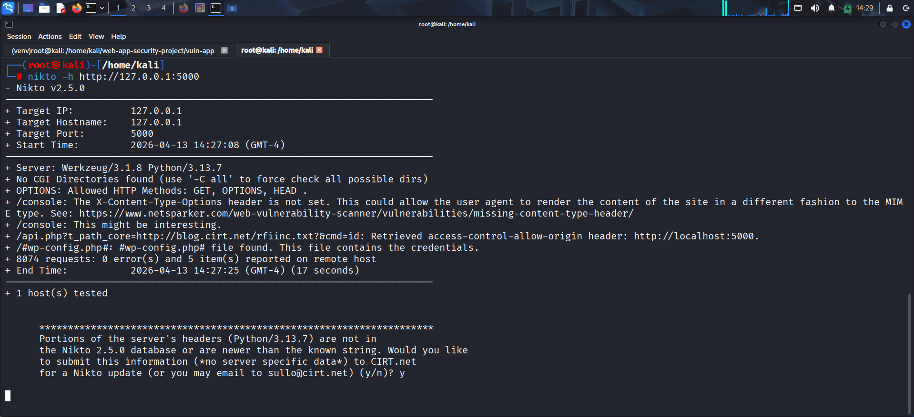

---

### 🔹 Lynis

* Performed system-level security audit
* Identified weak services and missing protections

#### 📸 Screenshots

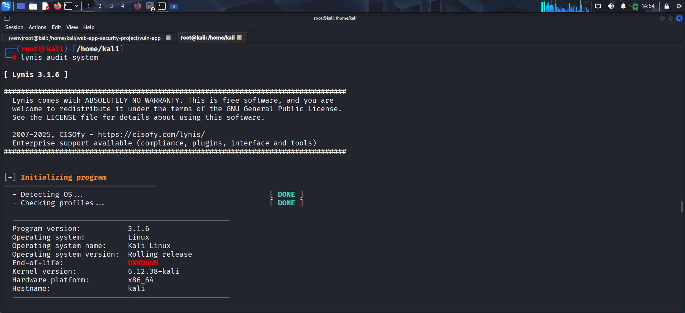
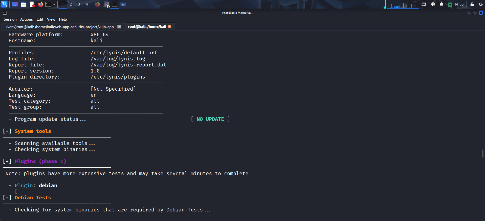
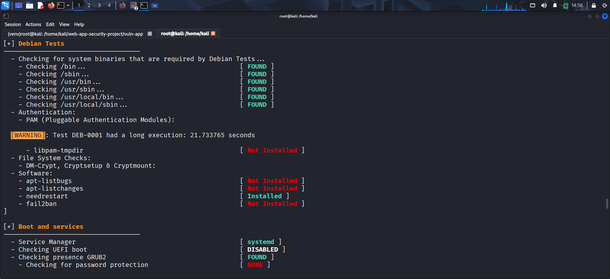
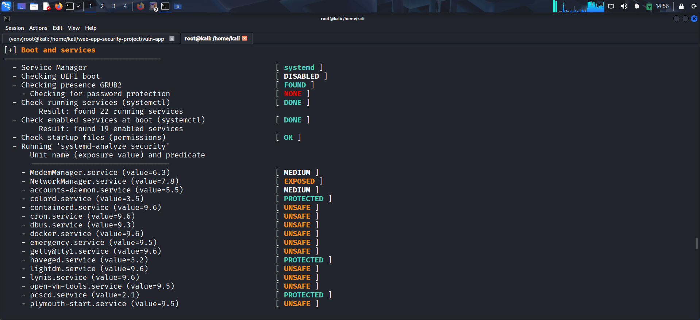
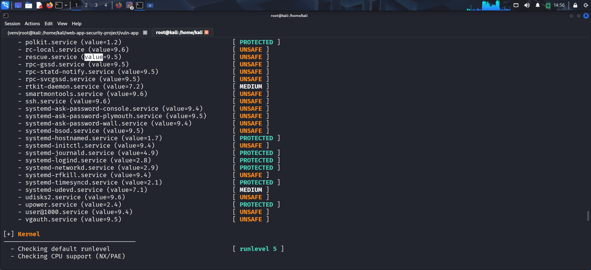
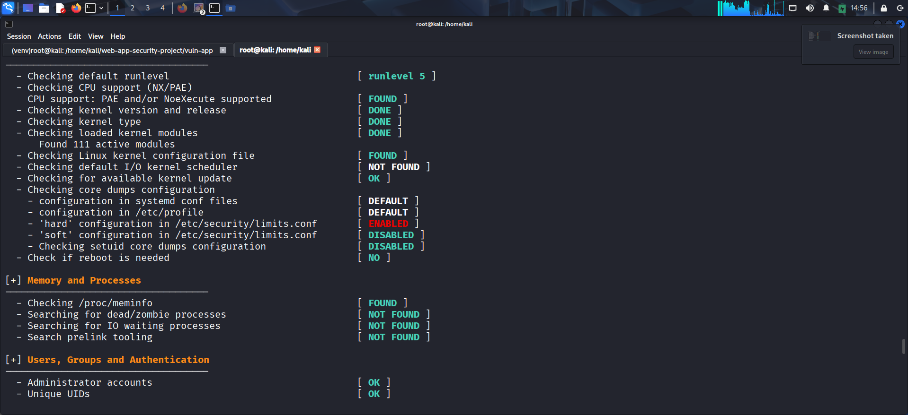
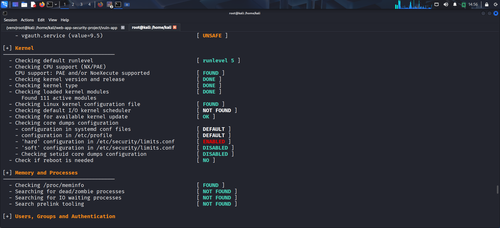
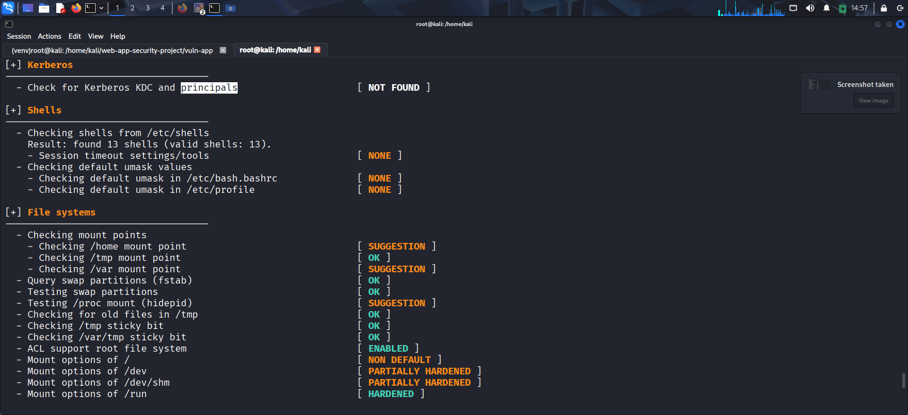
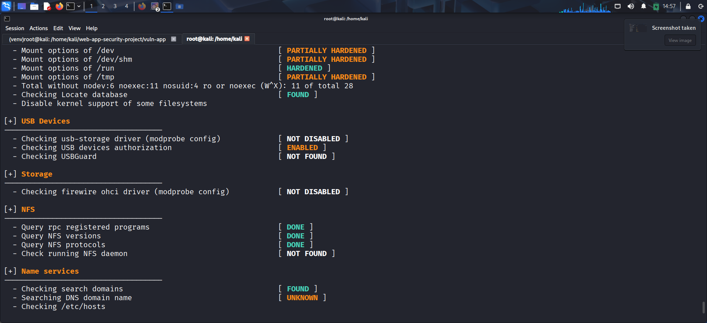
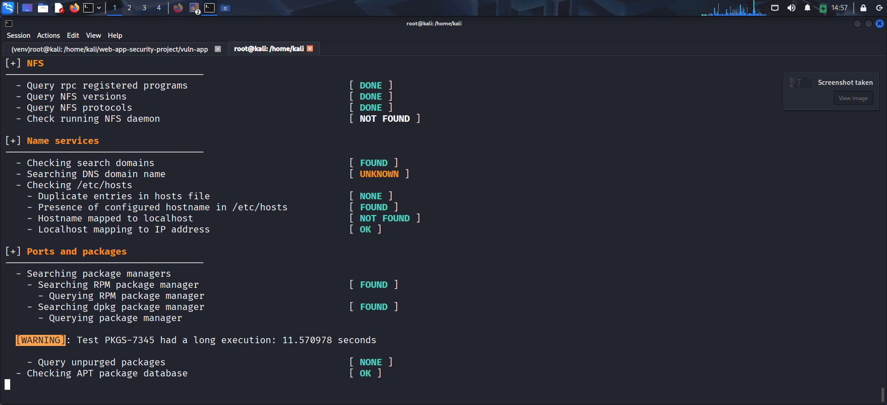

---

## 🚨 Key Findings

* Missing Content Security Policy (CSP)
* Server version information disclosure
* Missing X-Content-Type-Options header
* Unsafe system services
* Missing fail2ban (brute-force protection)

---

## 🔐 Security Improvements

* Implemented Content Security Policy (CSP)
* Removed sensitive server headers
* Disabled debug mode
* Added secure secret key handling
* Implemented rate limiting
* Identified system-level risks using Lynis

---

## 🧠 Conclusion

The application was successfully audited using multiple tools. Vulnerabilities were identified and mitigated, improving overall system security and aligning with OWASP Top 10 practices.

---

